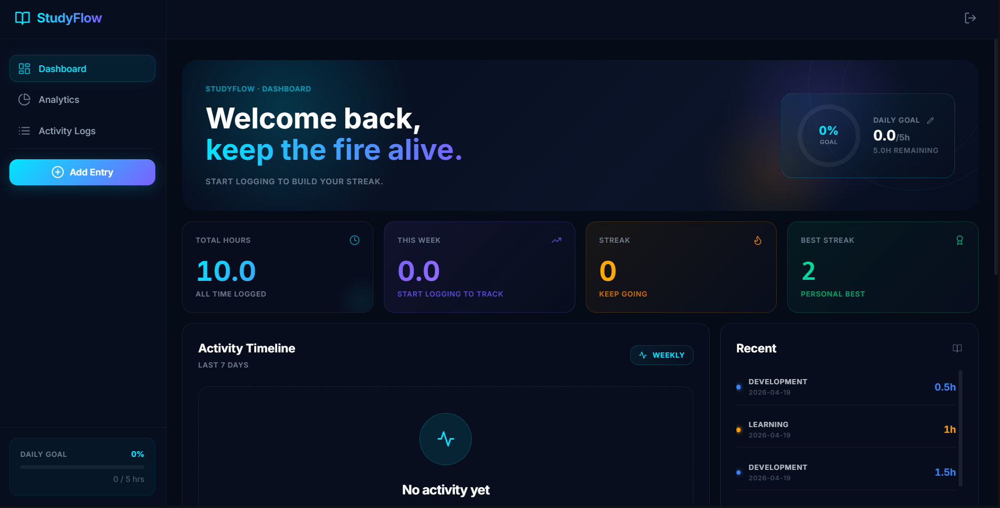
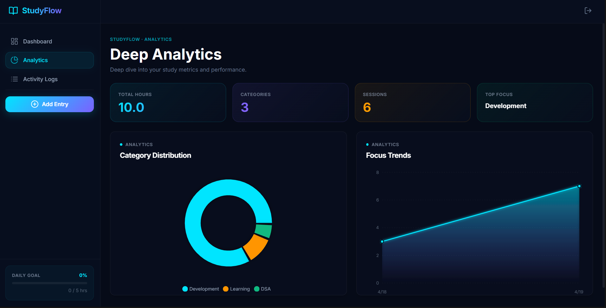
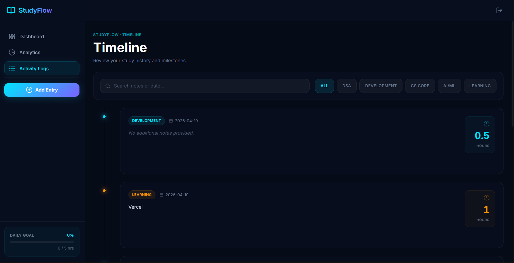

<div align="center">

<!-- Header -->


<br/>

<!-- Badges -->


<br/>

[](https://progress-tracking-system.vercel.app/)

<br/>

> **StudyFlow** is a full-stack study progress tracking system that helps students manage tasks, monitor productivity, and visualize their learning journey — all in one clean, responsive dashboard.

</div>

---

## 📱 Screenshots

<div align="center">

<table>
<tr>

<td align="center">

<br/>
<b>📊 Dashboard</b>
</td>

<td align="center">

<br/>
<b>📈 Analytics</b>
</td>

<td align="center">

<br/>
<b>✅ Task Tracker</b>
</td>

</tr>
</table>

</div>

---

## ✨ Features

- 🔐 **User Authentication** — Secure login & registration with JWT
- 📊 **Progress Dashboard** — Visualize your study progress at a glance
- ✅ **Task Management** — Create, update, and delete study tasks
- 📈 **Real-time Monitoring** — Track completion rates live
- 🎯 **Goal Setting** — Set targets and measure how far you've come
- 📱 **Fully Responsive** — Works seamlessly on all screen sizes
- 🌐 **Live Deployed** — Hosted on Vercel for instant access

---

## 🏗️ Tech Stack

| Layer | Technology |
|-------|-----------|
| ⚛️ Frontend | React 18 + Vite |
| 🎨 Styling | Tailwind CSS |
| 🔌 HTTP Client | Axios |
| ⚙️ Backend | Node.js + Express.js |
| 🗄️ Database | MongoDB Atlas |
| 🔐 Auth | JWT (JSON Web Tokens) |
| 🚀 Deployment | Vercel |

---

## 📁 Project Structure

```
StudyFlow/
├── src/                  # React (Vite) frontend
│   ├── components/       # UI components
│   ├── pages/            # Route pages
│   └── utils/            # Helpers & API calls
├── backend/              # Node.js + Express API
│   └── .env              # MONGO_URI, JWT_SECRET, PORT
├── dist/                 # Production build
├── index.html
├── vite.config.js
├── tailwind.config.js
└── vercel.json
```

---

## 🚀 Getting Started

### Prerequisites
- Node.js ≥ 18
- MongoDB Atlas account
- Git

---

### 🖥️ Backend Setup

```bash
# 1. Clone the repository
git clone https://github.com/Om-005/StudyFlow.git
cd StudyFlow

# 2. Navigate to backend
cd backend

# 3. Install dependencies
npm install

# 4. Create .env file
touch .env
```

Add to `.env`:
```env
PORT=5000
MONGO_URI=your_mongodb_connection_string
JWT_SECRET=your_secret_key
```

```bash
# 5. Start the backend server
npm start
```

Server runs at `http://localhost:5000` ✅

---

### 💻 Frontend Setup

```bash
# From project root
npm install

# Start development server
npm run dev
```

App runs at `http://localhost:5173` ✅

```bash
# Build for production
npm run build
```

---

## ☁️ Deployment

The app is deployed on **Vercel** with the following config (`vercel.json`):

| Service | Platform |
|---------|---------|
| Frontend | [Vercel](https://vercel.com) |
| Backend API | [Render](https://render.com) / [Railway](https://railway.app) |
| Database | [MongoDB Atlas](https://cloud.mongodb.com) |

🔗 **Live:** [https://progress-tracking-system.vercel.app](https://progress-tracking-system.vercel.app/)

---

## 🔮 Future Improvements

- 📊 Advanced analytics with charts & graphs
- 🔔 Study reminders & notifications
- 🤝 Collaboration & shared study groups
- 📱 React Native mobile app
- 🏆 Streaks & achievement badges
- 🤖 AI-powered study recommendations

---

## 👨‍💻 Authors

<div align="center">

<table>
  <tr>
    <td align="center">
      <b>Om Wadghule</b><br/>
      <a href="https://github.com/Om-005">
        
      </a>
      &nbsp;
      <a href="http://www.linkedin.com/in/om-wadghule-2005id">
        
      </a>
    </td>
    <td align="center">
      <b>Pritesh Jadhav</b><br/>
      <a href="https://github.com/Pritesh-Jadhav">
        
      </a>
    </td>
  </tr>
</table>

</div>

---

## 🤝 Contributing

Contributions are welcome! Feel free to:
1. Fork the repo
2. Create a new branch (`git checkout -b feature/your-feature`)
3. Commit your changes (`git commit -m 'Add some feature'`)
4. Push to the branch (`git push origin feature/your-feature`)
5. Open a Pull Request

---

## 📜 License

This project is open-source and available under the [MIT License](LICENSE).

---

<div align="center">

⭐ **If you found StudyFlow helpful, give it a star!** ⭐


</div>
